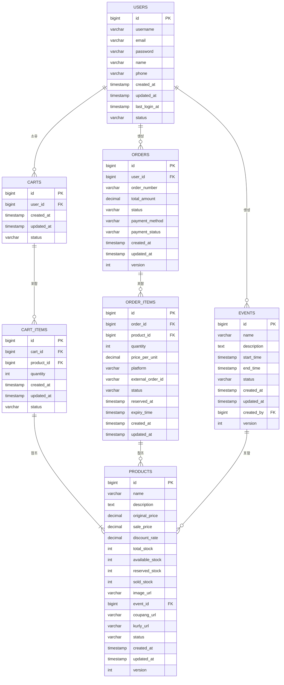
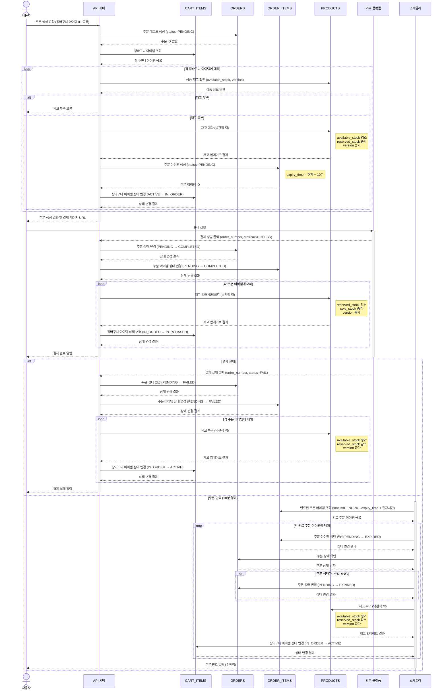

# 플래시 세일 이벤트 관리 시스템

## 1. 프로젝트 개요

**배경**:
* 인기 B2C 이커머스 회사 백엔드 개발자로 입사
* 마케팅팀에서 한정 수량 플래시 세일 이벤트 계획 중
* 상품들은 이미 쿠팡과 컬리에 등록되어 있음
* 자사 사이트에서 홍보 및 플래시 세일 이벤트 진행 예정
* 쿠팡/컬리의, AI 추천 시스템과 MCP 활용 계획

**이벤트 특성**:
* 동시 접속: 최대 20,000명이 1분 이내에 접속
* 한정 수량: 제한된 수량으로만 판매 (예: 1,000개)
* 높은 경쟁률: 높은 할인율로 인한 동시 구매 시도

**기술적 과제**:
* 동시성 문제: 재고 불일치 방지
* 시스템 과부하: 짧은 시간 내 많은 트랜잭션 처리
* 데이터 일관성: 결제 오류 시 데이터 정합성 유지
* AI 통합: 외부 플랫폼과 AI 추천 시스템의 효율적 연동

## 2. 유스케이스

### 상품 조회
* 이벤트 상품 목록 및 상세 정보 조회
* 쿠팡 및 컬리 상품 링크 연동
* AI 기반 맞춤형 상품 추천

### 상품 구매
* 장바구니 담기 (재고 확인만 수행, 예약 없음)
* 주문 생성 시 10분간 일시적 재고 예약
* 쿠팡/컬리 구매 페이지로 연결

### 동시 구매 처리
* 실제 재고 수량만큼만 판매 보장
* 재고 부족 시 품절 메시지 표시
* 미결제 상품의 재고 자동 복구

### 확장 기능 (선택적)
* **가격 및 재고 정보**: 할인가, 원가, 할인율, 남은 수량 표시
* **대기 리스트**: 품절 시 대기 등록, 재고 복구 시 알림
* **관리자 기능**: 상품/수량 설정, 실시간 모니터링
* **고급 추천 기능**: 사용자 행동 기반 AI 추천 개인화 강화

## 3. 데이터 모델

### ERD 다이어그램

#### 엔티티 관계도 (ERD) 요약

- USERS: 사용자 정보 (일반 사용자/관리자)
- EVENTS: 플래시 세일 이벤트 정보
- PRODUCTS: 판매 상품 정보 및 재고 상태
- CARTS: 사용자의 장바구니 정보
- CART_ITEMS: 장바구니에 담긴 상품 항목
- ORDERS: 주문 정보
- ORDER_ITEMS: 주문에 포함된 상품 항목

### 주요 엔티티 설명

#### PRODUCTS (상품)
- **재고 관리 필드**:
   - `total_stock`: 총 재고량
   - `available_stock`: 구매 가능한 재고량
   - `reserved_stock`: 예약된 재고량
   - `sold_stock`: 판매 완료된 재고량
- 항상 `total_stock` = `available_stock` + `reserved_stock` + `sold_stock`
- 외부 플랫폼 연동을 위한 URL 필드 (coupang_url, kurly_url)
- `version` 필드로 낙관적 락 구현

#### CART_ITEMS (장바구니 아이템)
- 상태 변화:
   - `ACTIVE`: 활성 상태 (기본)
   - `IN_ORDER`: 주문 진행 중
   - `PURCHASED`: 구매 완료

#### ORDERS (주문)
- 상태 변화:
   - `PENDING`: 주문 생성, 결제 대기
   - `COMPLETED`: 결제 완료
   - `FAILED`: 결제 실패
   - `CANCELLED`: 주문 취소
   - `EXPIRED`: 주문 만료 (10분 경과)
- `version` 필드로 낙관적 락 구현

#### ORDER_ITEMS (주문 아이템)
- 재고 예약 관련 필드:
   - `reserved_at`: 예약 시간
   - `expiry_time`: 만료 시간 (reserved_at + 10분)
- 상태 변화:
   - `PENDING`: 주문 생성, 결제 대기
   - `COMPLETED`: 결제 완료
   - `FAILED`: 결제 실패
   - `EXPIRED`: 예약 만료 (10분 경과)

## 4. 핵심 비즈니스 프로세스

### 장바구니/주문/결제 프로세스 흐름

1. **장바구니 담기 프로세스**
    - 사용자가 상품 장바구니 담기 요청
    - 상품 정보 및 재고 확인만 수행 (예약하지 않음)
    - 활성 장바구니 조회/생성
    - 장바구니 아이템 추가 (status: ACTIVE)
    - 사용자 활동 기록 (ADD_TO_CART)

2. **주문 생성 및 재고 예약 프로세스 (10분)**
    - 사용자가 주문 생성 요청
    - 주문 레코드 생성 (status: PENDING)
    - 장바구니 아이템 조회
    - 각 장바구니 아이템별:
        - 상품 정보 및 재고 확인
        - 재고 예약 (10분): available_stock 감소, reserved_stock 증가
        - 재고 변동 로그 기록 (RESERVE)
        - 주문 아이템 생성 (expiry_time: 현재+10분)
        - 장바구니 아이템 상태 변경 (ACTIVE → IN_ORDER)

3. **결제 프로세스**
    - 사용자가 결제 진행 (외부 플랫폼)
    - 결제 성공 시:
        - 주문 상태 업데이트 (PENDING → COMPLETED)
        - 주문 아이템 상태 업데이트 (PENDING → COMPLETED)
        - 재고 상태 업데이트: reserved_stock 감소, sold_stock 증가
        - 재고 변동 로그 기록 (PURCHASE)
        - 사용자 활동 기록 (PURCHASE)
        - 장바구니 아이템 상태 변경 (IN_ORDER → PURCHASED)
    - 결제 실패 시:
        - 주문 상태 업데이트 (PENDING → FAILED)
        - 주문 아이템 상태 업데이트 (PENDING → FAILED)
        - 재고 복구: available_stock 증가, reserved_stock 감소
        - 재고 변동 로그 기록 (RELEASE)
        - 장바구니 아이템 상태 변경 (IN_ORDER → ACTIVE)

4. **주문 만료 처리 (10분 경과 시)**
    - 스케줄러가 만료된 주문 아이템 조회 (status=PENDING, expiry_time < 현재)
    - 각 만료 주문 아이템별:
        - 주문 아이템 상태 변경 (PENDING → EXPIRED)
        - 관련 주문 상태 업데이트 (PENDING → EXPIRED)
        - 재고 복구: available_stock 증가, reserved_stock 감소
        - 재고 변동 로그 기록 (RELEASE)
        - 장바구니 아이템 상태 변경 (IN_ORDER → ACTIVE)

## 5. 구현 단계

### 1단계: 기본 구조 설계
* **엔티티 설계**: 상품, 주문, 사용자 엔티티 및 버전 관리 필드
* **API 엔드포인트**: 상품 조회, 장바구니, 주문/결제 API
* **서비스 레이어**: 계층 분리 및 DTO 변환

### 2단계: 트랜잭션 관리
* **트랜잭션 경계**: @Transactional 속성 설정, 원자적 처리
* **장애 처리**: 예약 실패 롤백, 예외 처리, 데이터 일관성
* **테스트**: 성공/실패 시나리오, 예외 상황, 격리 수준 테스트

### 3단계: 동시성 제어
* **낙관적 잠금**: 버전 관리, 충돌 감지, 재시도 메커니즘
* **요청 처리 최적화**: 캐싱 전략, 읽기/쓰기 분리
* **테스트**: 멀티스레드 테스트, 스트레스 테스트

### 4단계: 비동기 처리
* **비동기 처리**: @Async 설정, 비동기 작업 처리
* **재고 복구**: 예약 만료 시 자동 복구, 중복 실행 방지
* **모니터링**: 응답 시간 측정, 작업 상태 추적, 최적화

### 5단계: AI 기반 상품 추천
* **MCP 활용**: 쿠팡 및 컬리 상품 자동 수집 및 분석
* **AI 추천 시스템**: 사용자 특성 기반 맞춤형 상품 추천
* **외부 플랫폼 연동**: 쿠팡/컬리 API 연동 및 상품 데이터 동기화

## 6. 성능 최적화 방안

### 캐싱 전략
* 상품 정보 및 재고 상태 캐싱
* 읽기 작업 최적화
* 외부 플랫폼 연동 데이터 캐싱

### 분산 처리
* 수평적 확장 구조
* 서버 간 데이터 일관성 유지
* 외부 플랫폼과의 동기화 관리

### 병목 현상 대응
* 부하 분산 전략
* 타임아웃 및 재시도 정책
* 외부 API 호출 최적화

## 7. 기대 효과

* **비즈니스 문제 해결**: 실제 플래시 세일 시나리오 대응
* **트랜잭션 관리**: 복잡한 로직의 데이터 일관성 유지
* **동시성 제어**: 고부하 상황의 시스템 안정성
* **비동기 처리**: 사용자 경험 향상 및 시스템 효율성
* **AI 활용**: 사용자별 맞춤형 추천으로 구매 전환율 향상

## 8. 프로젝트 일정

* **Phase 1**: 기본 설계 및 엔티티 구현
* **Phase 2**: API 및 서비스 레이어 구현
* **Phase 3**: 동시성 제어 및 최적화
* **Phase 4**: 비동기 처리 및 테스트
* **Phase 5**: AI 추천 시스템 및 외부 플랫폼 통합
